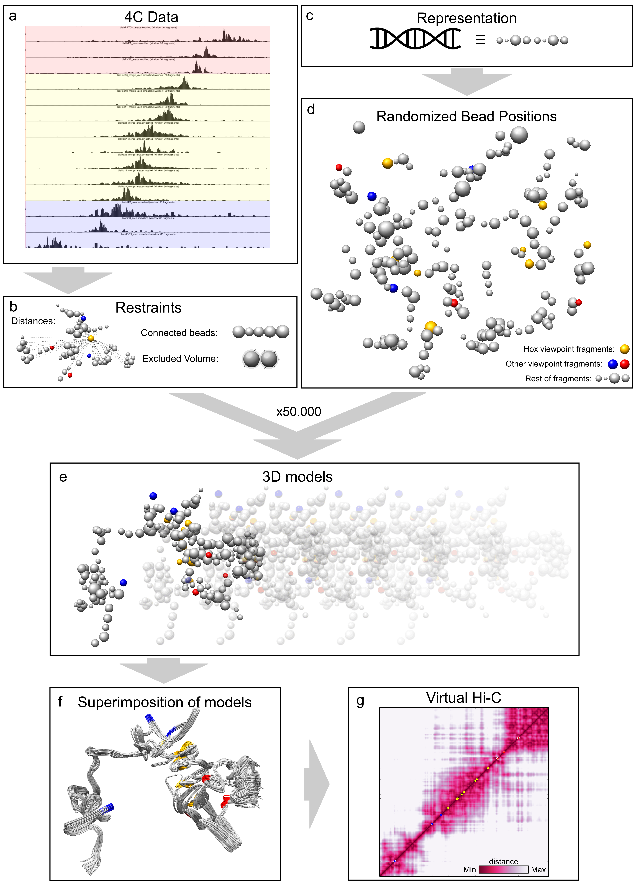
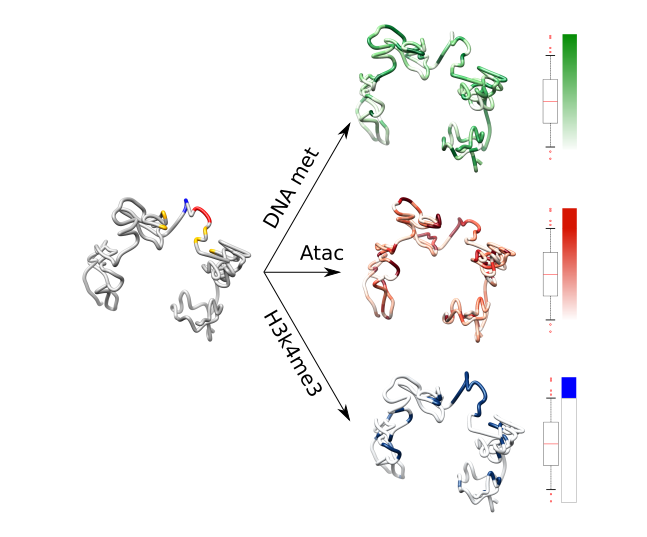

# 4c2vhic
This is a suite of scripts that lets you generate 3D models of the chromatin of your favourite locus, using 4C-seq data as the only input. It is able to crete Hi-C like contact maps of these 3D models and analyze the region further. 

Used in Acemel RD, Tena JJ, Irastorza-Azcarate I, Marletaz F, Gomez-Marin C, de la Calle-Mustienes E, Bertrand S, Diaz SG, Aldea D, Aury JM et al.: A single three-dimensional chromatin compartment in amphioxus indicates a stepwise evolution of vertebrate Hox bimodal regulation. Nat Genet 2016, 48: 336-341. (http://www.nature.com/ng/journal/v48/n3/full/ng.3497.html)

# Overview (still in progress)

GenomePainting

### Dependencies
python 2.7
chimera (Download from https://www.cgl.ucsf.edu/chimera/download.html)
IMP 2.5, 2.4 (newer versions crash) (Download from http://integrativemodeling.org/old-versions.html)
matplotlib
scipy

### Simple Usage (run this commands)
0 - # Modify config.ini paths

1 - python run_genome_maxd.py config.ini /bin/bash

2 - python src/calculate_best_maxd.py config.ini

2.5 - # Set the max distance in config.ini [ModelingValues]

3 - python run_genome_zscores.py config.ini /bin/bash

4 - python src/calculate_best_zscores.py config.ini

4.5 - # Set the max_z and min_z undert [ModelingValues] in config.ini

5 - python run_genome_sampling.py /bin/bash

5.5 - # 3D models are ready

6 - python src/GenomeAnalysis.py config.ini

7 - 

### Explained Usage
0 - Set the configuration file. Example is given in config.ini. [PREPARE THE CONFIG fILE]

0.5 - Input data can be checked calling data_manager.py. Shows 3 plots for each 4C file, showing read counts, Z scores and the conversion into distance restraints that would be used in the modeling.
      Example: python src/data_manager.py config.ini [0.2 -0.4 8000]  

1 - Run "run_genome_maxd.py" to get models with different max distances.
    Example: python run_genome_maxd.py config.ini /bin/bash 

2 - Run "Calculate_best_maxd.py" to get the optimum max distance. Get the max distance that has the most similar genome length to your data. We assume that the nucleotide length is of 0.1 nm ( reference here )
    Example: python src/calculate_best_maxd.py config.ini

3 - Set the optimum max distance in the config file (under [ModelingValues]) and run "run_genome_zscores.py"
    Example: python run_genome_zscores.py config.ini /bin/bash

4 - Run "calculate_best_zscores.py" to get the optimum zscores. set last argument to True to see the validation plots
    Example: python src/calculate_best_zscores.py config.ini True

5 - With the max distance and the upper and lower z-scores, modeling can start. Run "run_genome_sampling.py" setting the previous variables in the config file (under [ModelingValues]).
    Example: python run_genome_sampling.py

6 - run "src/GenomeAnalysis.py" to get a subset of all the models. The best models ordered by the IMP scoring function are gathered and also makes a superposition of all those models. The models are very likely to be mirror image of other models, getting two populations of models.
    Take into account that we need to tweak the std_dev and the cut_of_percentage under [AnalysisValues]. In my essays, I have seen that getting a 10-15% of the population and setting a 15% restraints fulfillment works well. 
    Example: python src/GenomeAnalysis.py config.ini 

7 - run "GenomeClustering.py" to get populations of best models depending on the similarity of the RMSD.
    K value needs to be set in the config file under [Clustering] to get that amount of populations. Also generates a superposition of each of the populations. If we get 2 populations that are mirror image of each other, we can be sure that the modeling went correctly.
    Example: python src/GenomeClustering.py config.ini

8 - run "TADs_multi.py" to generate the virtual Hi-C of one of the populations of the final models. We will set different values in the config file under [TADs] like:
    -viewpoints: to plot circles of genes or other interesting fragments in the virtual Hi-C
    -gene_names: the name of the previous viewpoints.
    -color: will set different colors to the viewpoints. The numbers follow the matplotlib palette.
    -number_of_cpu: for parallelization
    -maximum_hic_values: will smooth or "burn" the virtual Hi-C heatmap.

    We will set also the config file, the matrix file of one of the populations (normally the biggest one) and True if it is the first time we calculate the matrix. If we already calculated and we just one to add viewpoints, change color of them or set a different maximum_hic_value, we will set to False
    Example: python src/TADs_multi.py config.ini /home/user/4c2vhic/data/MyModels/MyModels_final_output/matrix397.txt True
    
9 - run "Final_genome_models.py"
    Takes as argument the matrix of one of the solutions from GenomeClustering.py. It will tell us which model is the one closest to the average. The beads of the models will be concatenated and all models will be matched. If we have many it will be slow, so we can modify the superposition.cmd file that we will launched using chimera. "chimera superposition.cmd" 
    Example: python src/Fina_genome_models.py /home/user/4c2vhic/data/MyModels/MyModels_final_output/matrix39
    7.txt config_ini

10 - run "GenomePainting.py"
    It will map epigenetic marks in a model of our choice. We will set in the config file under [Painting] if it is a bam or a bed file, the path of the epigenetic mark, and the color gradient in Hex format.
    Example: python src/GenomePainting.py /home/user/4c2vhic/data/MyModels/MyModels_final_output/model10.py config_ini

11 - run "Evo_comp.py" Evolutive comparison
    Given two distance_matrices generated with TADs_multi.py of different loci or organisms and the position of Genes/enhancers (beads), it crates a hi-c like matrix with the relative positions of both locus. We will need to set the config file variables under [EvoComp]. Similar to the [TADs] parameters, we will need to set the viewpoints and the window variable for each of the loci.
    Example: python src/Evo_comp.py config.ini /home/user/4c2vhic/data/MyModels/MyModels_final_output/distances_of_my_models /home/user/4c2vhic/OtherModels/OtherModels_final_output/distance_of_other_models

12 - di_calculation.py
    Given the distance matrix and the the number of beads a TAD has in your virtual HI-C, it plots the directionality index bar plot.
    python di_calculation.py distance_six_zebra 20

### Notes

- If you want to concatenate the beads with a tube, after openning the model in UCSF-Chimera, write this in its command line: "shape tube #X-Y radius Z bandlength 10000" (X and Y being the first and last beads, Z being the thickness of tube in Angstroms.)

- All the data will be stored under a directory with the same name as the prefix set in the config file
- the python scripts that are not in the src/ directory are scripts that I used for my projects. If you want to use them with another queue system or change the bins between each iteration, feel free to modify or create your own.
    * run_mode /bin/bash is set to work in the background with &, its not a proper parallelization, use a queue system better.
- bam files need to be sorted and indexed before using. Example: samtools sort mouse_h3k4me3_ES_bingren_rep1.bam mouse_h3k4me3_ES_bingren_rep1.bai 
#TODO
    write down that chimera needs to be a "ln -s" and give permissions to whole python2.7 inside chimera/bin also
    IMP 2.5 <
    if "AttributeError: 'Model' object has no attribute 'this'"
    install Swig 3.0.7. For this perhaps u need to install sudo apt-get install libpcre3 libpcre3-dev
    remember that the bash scripts are also done by me, they can change it if they want. Right now I don't know how to take from the config file the data and use it in the bash script

    pip install pysam. If does not work, git clone 
    and then 

    python setup.py build
    python setup.py install (libcurl4-gnutls-dev )
    !if u get an error saying regcompA was not found, rename regex.h from the boost library (in my case /usr/local/include/regex.h) to something else before building. The change it back!

    in GebnomePainting, add "py bed tools" to read data

    ~~

    pip install colour
    : https://pypi.python.org/pypi/colour

    genome Painting make it better, no color_to color from only these:
    http://matplotlib.org/examples/color/colormaps_reference.html
