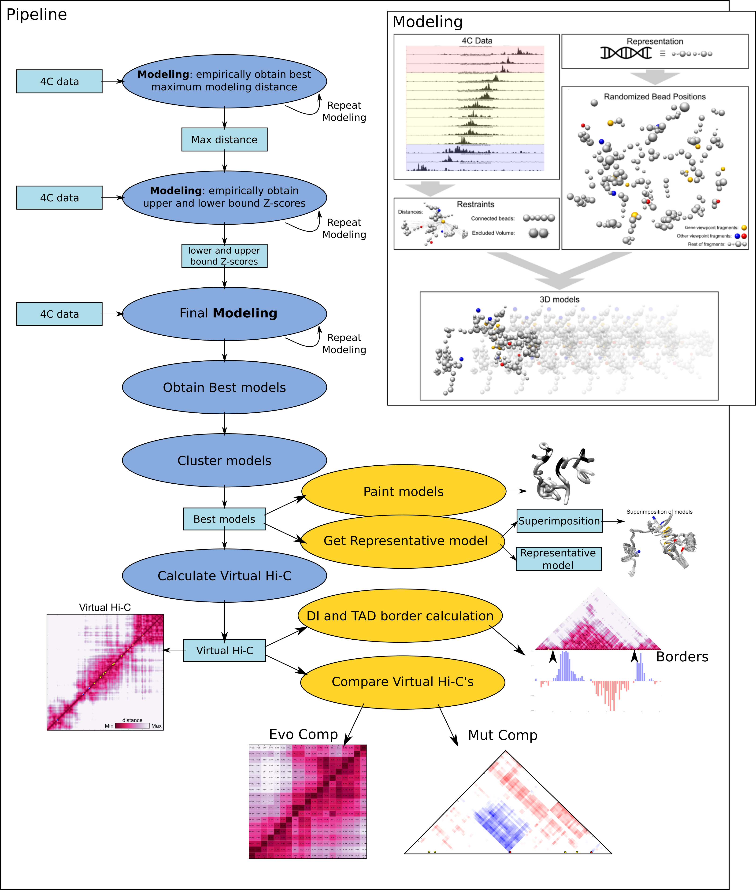
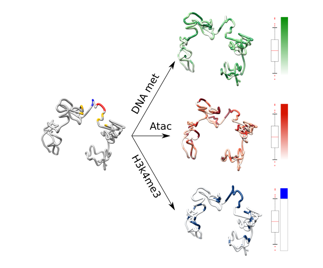

# 4Cin

4Cin is a suite of scripts that lets you generate 3D models of the chromatin of your favourite locus, using 4C data as the only input. It is able to create Hi-C like contact maps of these 3D models and analyze the region further. 

Used in Acemel RD, Tena JJ, Irastorza-Azcarate I, Marletaz F, Gomez-Marin C, de la Calle-Mustienes E, Bertrand S, Diaz SG, Aldea D, Aury JM et al.: A single three-dimensional chromatin compartment in amphioxus indicates a stepwise evolution of vertebrate Hox bimodal regulation. Nat Genet 2016, 48: 336-341. (http://www.nature.com/ng/journal/v48/n3/full/ng.3497.html)

## Dependencies

Note: Tested only in Linux, of course.
```
python 2.7
matplotlib
scipy
numpy
UCSF Chimera (Download from https://www.cgl.ucsf.edu/chimera/download.html)
IMP 2.5, 2.4 (newer versions crash) (Download from http://integrativemodeling.org/old-versions.html)
pysam (for paint_model.py)
```

Go to Installing dependencies(https://github.com/batxes/4Cin/blob/master/README.md#installing-dependencies) to install them.


## Fast Usage

```  
1 - python src/prepare_data.py /path/to/data/all_4C_data
2 - Provide a primers.txt file with name of primers and position:
    viewpoint1 chr2:423234
    viewpoint2 chr2:426351
    viewpoint3 chr2:449584
    viewpoint4 chr2:501421    
3 - python 4Cin.py /path/to/data/ Name_of_your_locus
```

[Optionals]
```
1.5 - python src/data_manager.py /path/to/my/data/ Name_of_your_locus
4 - python src/paint_model.py Representative.py 
                              /path/to/my/data/ 
                              epigenetic_data colormap
5 - python src/calculate_boundaries.py vhic.txt
6 - python src/Evo_comp.py /path/to/my/data/ 
                            Name_of_your_locus 
                            vhic.txt 
                            max_distance_of_locus
                            /path/to/my/otherdata/ 
                            Name_of_your_other_locus 
                            other_vhic.txt 
                            max_distance_of_other_locus
7 - python src/Mut_comp.py /path/to/my/data/ 
                            locus vhic.txt 
                            max_distance_of_locus
                            mutant_locus 
                            mutant_vhic.txt 
                            max_distance_of_mutant_locus
```

## Explained Usage


1 - run "prepare_data.py" to homogenize the 4C files. All 4C files need to have the same number of fragments and the same length.

>Example: python src/prepare_data.py /path/to/data/all_4C_data

2 - Generate primers.txt file, with name of genes and position. Optional, primers_vhic.txt (the same format as in primers.txt) with more positions to paint in the virtual Hi-C. color can be added afterwards.

>Example primers.txt:     

    viewpoint1 chr2:423234
    viewpoint2 chr2:426351
    viewpoint3 chr2:449584
    viewpoint4 chr2:501421    
    
>Example primers_vhic.txt:     
    
    viewpoint1 chr2:423234 red
    viewpoint2 chr2:426351 cyan
    viewpoint3 chr2:449584
    viewpoint4 chr2:501421 
    geneA chr2:526921 lightgreen
    geneB chr2:439558 darkviolet
    enhancer1 chr2:468954 lightgreen
    
    if no color stated, default will be yellow.

3 - Do the modeling.

>Example: 

    python 4Cin.py /path/to/data/ Name_of_your_locus

    
     
Optional Steps:

11 - run "paint_model.py". It will map epigenetic marks in a model of our choice. We will set the path of the bed or bam file and the colormap (matplotlib). 

>Example: 

          python src/paint_model.py /home/user/4Cin/MyModels/MyModels_final_output/Representative.py 
                                    /home/user/4Cin/data/my_data/  
                                    /home/user/4Cin/data/epigenetic_data.bam 
                                    Blues

12 - run "calculate_boundaries.py". Given the virtual Hi-C matrix it plots the directionality index plot.

>Example: 
    
    python src/calculate_boundaries.py /home/user/4Cin/MyModels/MyModels_final_output/vhic_MyModels.txt

13 - run "Evo_comp.py". Evolutive comparison. Given two vhics, it creates a hi-c like matrix with the relative positions of both loci. The conserved regions will be set in two primers_evocomp.txt, each under each data directory. 
>Example primers_evocomp.txt:     
    
    a chr2:423234 red
    b chr2:426351 cyan
    c chr2:449584
    d chr2:501421 
    geneA chr2:526921 lightgreen
    geneB chr2:439558 darkviolet
    e chr2:468954 lightgreen

>Example
    
          python src/Evo_comp.py /home/user/4Cin/data/my_zebra_data/ 
                                 Zebra_models 
                                 /home/user/4Cin/Zebra_models/Zebra_models_final_output/vhic_Zebra_models.txt 
                                 max_distance_of_Zebra_models_locus
                                 /home/user/4Cin/data/my_mouse_data/ 
                                 Mouse_models 
                                 /home/user/4Cin/Mouse_models/Mouse_models_final_output/vhic_Mouse_models.txt 
                                 max_distance_of_Mouse_models_locus
    
14 - run "Mut_comp.py". Mutation comparison. The same as Evo_comp.py, but this time the same locus is compared. Useful to study structural genomic variations like inversions, truncations, deletions... primers_vhic.txt will be used to paint positions in the vhic.

>Example

          python src/Mut_comp.py /home/user/4Cin/data/my_locus/ 
                                 wt_models 
                                 /home/user/4Cin/wt_models/wt_models_final_output/vhic_wt_models.txt 
                                 max_distance_of_wt_models
                                 mutant_models 
                                 /home/user/4Cin/mutant_models/mutant_models_final_output/vhic_mutant_models.txt 
                                 max_distance_of_mutant_models

15 - Input data can be checked calling data_manager.py. Shows 3 plots for each 4C file, showing read counts, Z scores and the conversion into distance restraints that would be used in the modeling.

>Example: 
    
    python src/data_manager.py /home/user/4Cin/data/my_locus/ [0.2 -0.4 8000]  

### Installing dependencies

Matplotlib, scipy and numpy:
```
apt-get install python-matplotlib
apt-get install python-scipy
apt-get install python-numpy
```
To install Chimera:

make it executable: 
>chmod +x chimera-installer.bin
run it
make link: >ln -s CHIMERA/bin/chimera /usr/local/bin/chimera 
if problems visit: https://www.cgl.ucsf.edu/chimera/data/downloads/1.11.2/linux.html

Install IMP from source:
```
sudo apt-get install cmake
sudo apt-get install libboost1.49-all-dev
sudo apt-get install libhdf5-dev
sudo apt-get install swig
sudo apt-get install libcgal-dev
sudo apt-get install python-dev
```
Note: For Ubuntu 13.10 libboost1.53-all-dev should be installed instead. 
      For Ubuntu 14.04 libboost1.54-all-dev should be installed instead.

Download the IMP tarball file from http://salilab.org/imp/ and uncompress it:

>wget https://integrativemodeling.org/2.5.0/download/imp-2.5.0.tar.gz -O imp-2.5.0.tar.gz
>tar xzvf imp-2.5.0.tar.gz

Create a directory for the IMP instalation.

>mkdir IMP

Move into the IMP directory and compile the code (Note: the -j option stands for the number of CPUs you want to assign to the compiler; the higher the faster).

>cd IMP

>cmake ../imp-2.5.0 -DCMAKE_BUILD_TYPE=Release -DIMP_MAX_CHECKS=NONE -DIMP_MAX_LOG=SILENT

>make -j4

Once the compilation has finished, open the file setup_environment.sh in your IMP directory and copy the first lines into your >~/.bashrc file (if this file in not present in your home directory, create it). These lines should look like:

>LD_LIBRARY_PATH="/SOMETHING/imp-2.5.0/lib:/SOMETHING/imp-2.5.0/lib:/SOMETHING/imp-2.5.0/src/dependency/RMF/:$LD_LIBRARY_PATH"
export LD_LIBRARY_PATH

>PYTHONPATH="/SOMETHING/imp-2.5.0/lib:/SOMETHING/imp-2.5.0/lib:/SOMETHING/imp-2.5.0/src/dependency/RMF/:$PYTHONPATH"
export PYTHONPATH

Important note: Do not copy the lines above, copy them from setup_environment.sh, where SOMETHING is replaced by your real path to IMP. 

Installation process of IMP taken from: https://3dgenomes.github.io/TADbit/install.html#imp-3d-modeling


Install pysam (only for paint_model.py)
>pip install pysam. 

If does not work:
    >git clone git@github.com/pysam-developers/pysam
    >python setup.py build
    >python setup.py install (libcurl4-gnutls-dev )
    
    !if u get an error saying regcompA was not found, rename regex.h from the boost library (in my case /usr/local/include/regex.h) to something else before building. The change it back!

### Additional scripts
Getting 4C data like from Hi-C

python data/get_data.py  -> generates 4C like files from the Hi-C file

calculate_vhic_from_realdata.py
convert_HiC_data.py
HiC_comp.py

### Notes

- If you want to concatenate the beads with a tube, after openning the model in UCSF-Chimera, write this in its command line: "shape tube #X-Y radius Z bandlength 10000" (X and Y being the first and last beads, Z being the thickness of tube in Angstroms.)

- All the data will be stored under a directory with the same name as the prefix, unless we set it under --working_dir parameter 

- bam files need to be sorted and indexed before using. Example: samtools sort mouse_h3k4me3_ES_bingren_rep1.bam mouse_h3k4me3_ES_bingren_rep1.bai 

# FAQ

I have UCSF Chimera installed but it does not work.
    Create a link to chimera with "ln -s" and give permissions to whole python2.7 inside chimera/bin


"AttributeError: 'Model' object has no attribute 'this'"
    install Swig 3.0.7. For this perhaps u need to install sudo apt-get install libpcre3 libpcre3-dev
  
matplotlib colors are here:
http://matplotlib.org/examples/color/colormaps_reference.html

GenomePainting does not work.
    Check the file generated coloring.cmd and fix the path. Chimera does not like if the first line is something like "open ../myModel.py". Change to something like /home/user/myModel.py.
    
Modeling can't find my viewpoints or I can't show positions in the vHi-Cs.
    Check that your primers files (primers.txt, primers_vhic.txt and primers_evocomp.txt) are as follows:
    NAME    chrX:position   

### references

ref1. Tjong H, Gong K, Chen L, Alber F. Physical tethering and volume exclusion determine higher-order ge- nome organization in budding yeast. Genome Res. 2012; 22: 1295–1305. doi: 10.1101/gr.129437.111 PMID: 22619363

ref2. Bystricky K, Heun P, Gehlen L, Langowski J, Gasser SM. Long-range compaction and flexibility of inter- phase chromatin in budding yeast analyzed by high-resolution imaging techniques. Proc Natl Acad Sci U S A. 2004; 101: 16495–16500. PMID: 15545610


###### writeee
    we modified the windows so the beads represent the same in SIX comparison    
    Pax3 data -> take our locus
    then take chr2 and chr13 separately and apply prepare_data.py
    then concatenate them and double the value of the aberrant 2+13 chromosome

Installing without SUDO:
###cmake install###
###Download latest cmake (currently 3.8.0) and unpack it###
tar xvf cmake-3.8.0-rc1.tar.gz
cd cmake-3.8.0-rc1
./configure --prefix=/path/to/cmake
make & make install
###Include cmake in the $PATH environment variable
export PATH=$PATH:/path/to/cmake/bin


###install latest boost C++ (currently 1.63.0)###
tar xvf boost_1_63_0.tar.gz
cd boost_1_63_0
./bootstrap.sh
./b2 install --prefix=/path/to/boost


###install latest swig currently(3.0.12)
tar xvf swig-3.0.12.tar.gz
cd swig-3.0.12
./configure --prefix=/path/to/swig
make & make install

###install latest hdf5 currently (1.8.18)
tar xf hdf5-1.8.18.tar
cd hdf5-1.8.18
./configure --prefix=/path/to/hdf5
make & make install

###Download IMP 2.5.0 and unpack ##
tar xvf imp-2.5.0.tar.gz 
mkdir IMP
cd IMP 
####Prepare son environmental variables with paths to boost, swig and hdf5
export BOOST_ROOT=/path/to/boost
export HDF5_ROOT=/path/to/hdf5
####COMPILE IMP ####
cmake ../imp-2.5.0 -DCMAKE_BUILD_TYPE=Release -DIMP_MAX_CHECKS=NONE -DIMP_MAX_LOG=SILENT -DSWIG_EXECUTABLE=/path/to/swig/bin/swig-3.0.12

## Overview 


Many other marks can be painted



